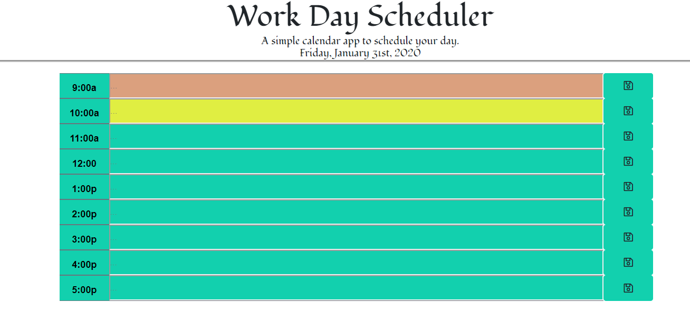
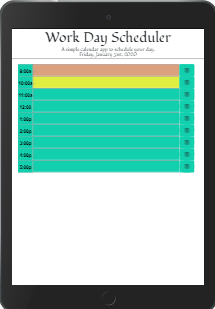
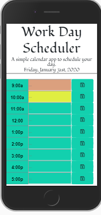

# KCDayPlanner
## Single Day - Day Planner

**Description:**

A simple calendar application that allows the user to save events for each hour of the day.  App will run in the browser and features dynamically updated HTML and CSS powered by jQuery.  The following conditions were met:

1. Planner is set for standard business hours (9 a.m. to 5 p.m.).
2. Each time slot represents 1 hour block.
3. Each block should contain the following:
        -a. The Hour
        -b. An Input Field
        -c. A Save/Commit Button
4. "Save/Commit" will store time and user input in localStorage.
5. Current Day/Date will update dynamically daily at top of page.
6. Input Field is highlighted to denote current vs past and future events.

**Usage:**
Companies often proactively encourage the use of planners as a tool for time management.  Poor time management can be very costly resulting in missed meeting, deadlines or creating the appearance of unproffessionalism.  A planner allows employees to see their day at a glance, schedule time effectively, and improve productively.

### File List:

1. Index.html
    
    Main Page - Day Planner

2. Quiz.js    
    
    Javascript for Main Page 

3. Moment.js

    Moment code

4. Style.css

    Stylesheet for all.js 

5. Reset.css         

    Compressed set of CSS rules that resets the styling of all HTML elements to a consistent baseline.

### Link to site

https://karna1014.github.io/KCDayPlanner/.

### Index Page - Full Screen/Laptop View

### Responsiveness - I-Pad (768px)

### Responsiveness - I-Phone 6-7-8 (375px)

